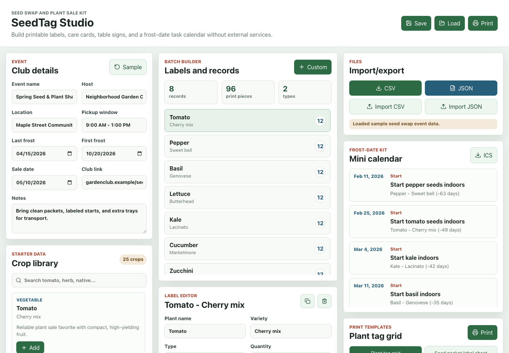
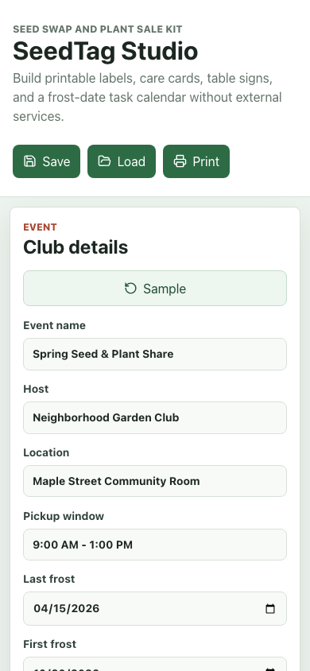

# SeedTag Studio

SeedTag Studio is a static web app for garden clubs, seed libraries, and plant sale volunteers. It builds printable plant tags, seed packet labels, care cards, sale table signs, and a frost-date task calendar from one editable batch of plant records.

Live demo: https://huslayer826.github.io/seedtag-studio/

## Screenshots




## What it does

- Create labels for plant starts, seed packets, care cards, and table signs.
- Start from 20+ built-in vegetables, herbs, flowers, and general native-plant examples.
- Edit plant name, variety, type, sun, water, spacing, sowing notes, price or donation, quantity, and care link.
- Generate QR codes locally in the browser from the bundled `qrcode` package. No QR service or CDN is used.
- Build a mini calendar from a manual last frost date and per-crop task offsets.
- Download an `.ics` calendar file for volunteer planning.
- Import and export CSV, export/import full JSON, and save/load locally with browser localStorage.
- Print clean sheets from the browser with print-specific CSS.

## Use It

1. Open the app and update the event details, last frost date, sale date, and club link.
2. Add crops from the starter library or create a custom plant record.
3. Adjust quantities and care notes for the batch.
4. Choose a print template: plant tag grid, seed packet labels, care cards, or sale table sign.
5. Use **Print** for paper output, **CSV** for spreadsheet sharing, **JSON** for a full backup, or **ICS** for calendar tasks.

## Local Development

```bash
pnpm install
pnpm dev
pnpm test
pnpm build
```

The Vite base path is set to `/seedtag-studio/` for GitHub Pages.

## Deployment Notes

This project is designed for GitHub Pages. The included workflow builds the app and deploys the `dist` folder. Enable GitHub Pages with Actions as the source.

## Data Notes

Starter crop timings are practical defaults, not local extension-office advice. Clubs should adjust dates, crop offsets, and native-plant examples for their region and seed source.
